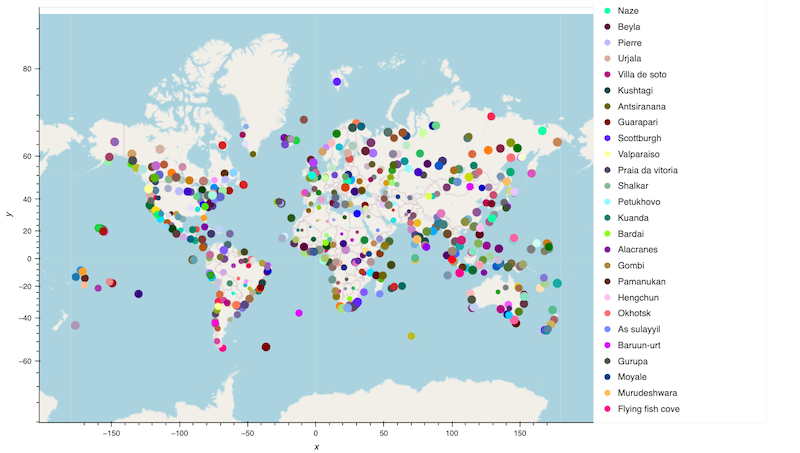

# python-api-challenge
Using Python REST APIs to retrieve and visual weather conditions

### Introduction
In this project we made use of the RESTful [OpenWeather API](https://openweathermap.org/api) to summarize weather conditions vs proximity to the equator for about 500 randomly selected cities across the globe. Additionally, the [Geoapify API](https://www.geoapify.com/) was used to located hotels for cities which match certain weather conditions. The results and code can be found in the [WeatherPy](WeatherPy/WeatherPy.ipynb) and [VacationPy](WeatherPy/VacationPy.ipynb) Jupyter notebooks. 

### Key Findings

The correlation between Temperature and distance from the Equator: 

Randomly selected cities and those with weather conditions of temperature between 21 and 32 deg C, humidity of less than 60%, and plenty of sunshine.

